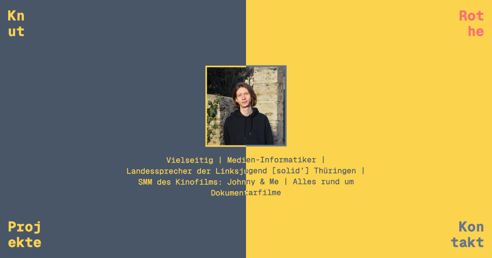

# Meine kleine [Knut Red / Knut C. Rothe] Persöhnliche und brutalistische Web-Dev Seite

[knutred.github.io](https://knutred.github.io)

## Features

1. [View transitions](https://developer.mozilla.org/en-US/docs/Web/API/View_Transitions_API)
2. Darkmode
3. Custom [404 Page](https://knutred.github.io/404)
4. [i18n](https://docs.astro.build/en/recipes/i18n/#translate-routes) Support für Deutsch und Englisch
5. Easter Egg 🎉

## Pläne

1. Hosting mit Github-Pages verknüpfen
2. Evtl. Open-Source für dieses Projekt inklusive einer Lizenz

## Technologien

- Font: Geist-Mono
- Astro
- Tailwind
- Canvas Confetti